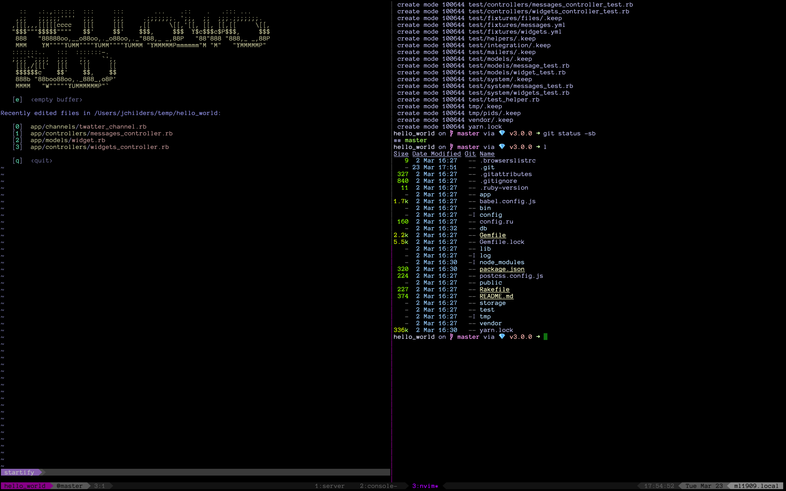
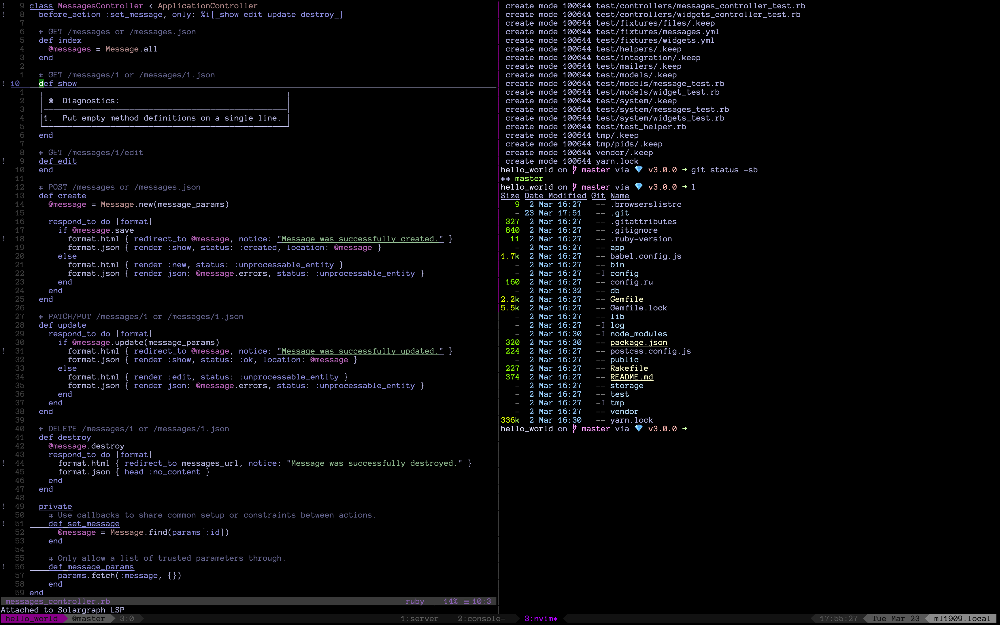
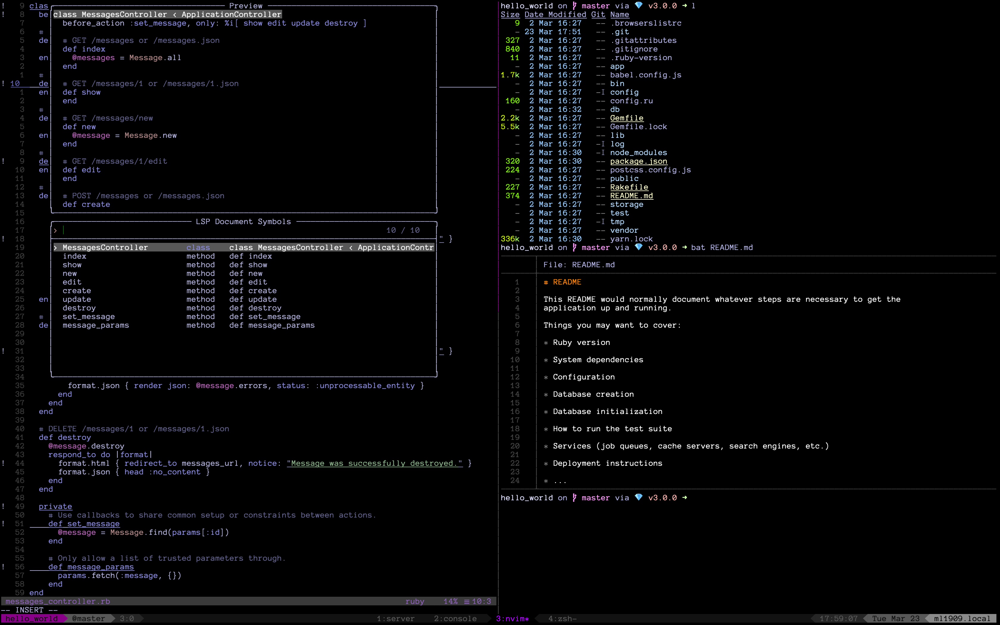
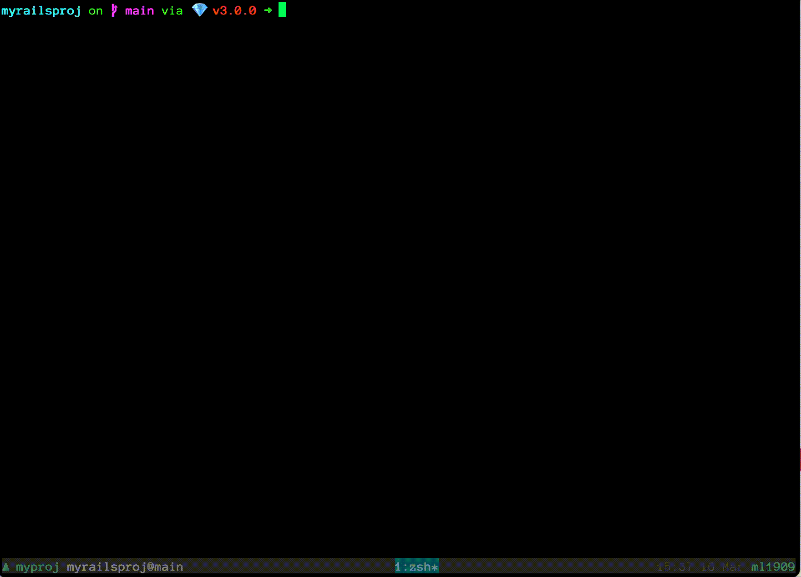

# What?

Configurations for neovim, zsh, tmux, and macOS, with a focus on neovim.

# Philosophy

- Unix as IDE
- Eliminate need for mice/trackpads & arrow keys
- *Quickly* get to files you need
- VSCode is for the weak





# Installation

`make install` - All The Things. Installs homebrew, Ruby, default homebrew
formalae (including tmux), clones & builds neovim from source, and links all
configuration files (dotfiles). Typically used when bootstraping a new
development machine.

`make dotfiles` - Links configuration files (dotfiles) only, without installing anything

`make neovim-config neovim-plugins` - Install neovim configuration files
(dotfiles) and plugins. Use this if you already have neovim installed and just
want to test out the neovim configurations provided by this repo.

`make zsh-config` - Install zsh configuration files (dotfiles). Use this if you
just want to test out the zsh configuration.

`make` - List available targets

# zsh
## Mappings
The following mappings (widgets) are available from the zsh prompt:

| mapping | description |
| :-----: | :---------- |
| <kbd>^oa</kbd> | Fuzzy find modified file & add to staging area (`git add`) |
| <kbd>^oc</kbd> | Fuzzy find Rails controller & edit |
| <kbd>^od</kbd> | Fuzzy find modified file & diff |
| <kbd>^of</kbd> | Fuzzy find file & edit |
| <kbd>^oF</kbd> | Fuzzy find *any* file (ignores `.gitignore`) & edit |
| <kbd>^om</kbd> | Fuzzy find Rails model & edit |
| <kbd>^os</kbd> | Fuzzy find modified file & edit
| <kbd>^ov</kbd> | Fuzzy find Rails view & edit |
| <kbd>^t</kbd> | Fuzzy find file and append to current cursor position |
| <kbd>^r</kbd> | Fuzzy search command history (`^r<enter>` to run last command) |

## Aliases
Defined in `zsh/config/aliases.zsh`

| alias | description |
| :---: | :---------- |
| <kbd>bi</kbd> | `bundle install` |
| <kbd>gcb</kbd> | Copies current branch name to pasteboard (clipboard) |
| <kbd>gd</kbd> | `git diff` |
| <kbd>gst</kbd> |  `git status -sb` |
| <kbd>rc</kbd> | `rails console` |
| <kbd>rdbm</kbd> | `rake db:migrate` |
| <kbd>rdbms</kbd> | `rake db:migrate:status` |
| <kbd>rdbmt</kbd> | `rake db:migrate RAILS_ENV=test` |
| <kbd>rdbmst</kbd> | `rake db:migrate:status RAILS_ENV=test` |
| <kbd>rs</kbd> | `rails server` |

## Directory Navigation

Use `z`. For example:

```
➜ cd ~/workspace/myrailsproj
➜ pwd
/Users/jchilders/workspace/myrailsproj
➜ cd
➜ pwd
/Users/jchilders
➜ z myraiprj # <-- easy!
➜ pwd
/Users/jchilders/workspace/myrailsproj
```

## Working with git

This shows a Rails project with two modified files. They are each diffed using `^od`, then added to the git staging area using `^oa`. 



# Neovim

Leader key is `,`.

## Mappings

| mapping | description | provided by |
| :-----: | :---------- | :---------: |
| <kbd>^ob</kbd> | Fuzzy switch buffer by filename | telescope.nvim |
| <kbd>^oc</kbd> | Fuzzy find Rails controller & edit | telescope.nvim |
| <kbd>^of</kbd> | Fuzzy find file & edit | telescope.nvim |
| <kbd>^oF</kbd> | Fuzzy find *any* file & edit (ignores `.gitignore`) | telescope.nvim |
| <kbd>^om</kbd> | Fuzzy find Rails model & edit | telescope.nvim |
| <kbd>^or</kbd> | Fuzzy go to symbol (method name, etc.) | telescope.nvim |
| <kbd>^os</kbd> | Fuzzy find modified file & edit | telescope.nvim |
| <kbd>^ov</kbd> | Fuzzy find Rails view & edit | telescope.nvim |
| <kbd>,,</kbd> | Switch between next/previous buffers |
| <kbd>,ccs</kbd> | Change (rename) current symbol | neovim LSP |
| <kbd>,fmt</kbd> | Format current buffer | neovim LSP |
| <kbd>gJ</kbd> | Join code block | splitjoin.vim |
| <kbd>gS</kbd> | Split code block | splitjoin.vim |
| <kbd>,]]</kbd> | Go to next error/warning | neovim LSP |
| <kbd>,[[</kbd> | Go to previous error/warning | neovim LSP |
| <kbd>,e</kbd> | Show error/warning | lspsaga.nvim |
| <kbd>,g</kbd> | Toggle gutter | g:ToggleGutter() |
| <kbd>,c<Space></kbd> | Comment/uncomment current line | nerd-commenter |
| <kbd>3,c<Space></kbd> | Comment/uncomment 3 lines | nerd-commenter |
| <kbd>Enter</kbd> | Clear highlighted search | Native |

## Ruby- and Rails-specific Mappings
| mapping | description |
| :-----: | :---------- |
| <kbd>^oc</kbd> | Fuzzy find Rails controller & edit | telescope.nvim |
| <kbd>^om</kbd> | Fuzzy find Rails model & edit | telescope.nvim |
| <kbd>^ov</kbd> | Fuzzy find Rails view & edit | telescope.nvim |
| <kbd>,bp</kbd> | Insert `binding.pry` statement below current line |
| <kbd>,bP</kbd> | Insert `binding.pry` statement above current line |
| <kbd>,rp</kbd> | Insert `puts` statement below current line |
| <kbd>,rP</kbd> | Insert `puts` statement above current line |
| <kbd>,rt</kbd> | Run most recently modified spec in tmux pane to the left |
